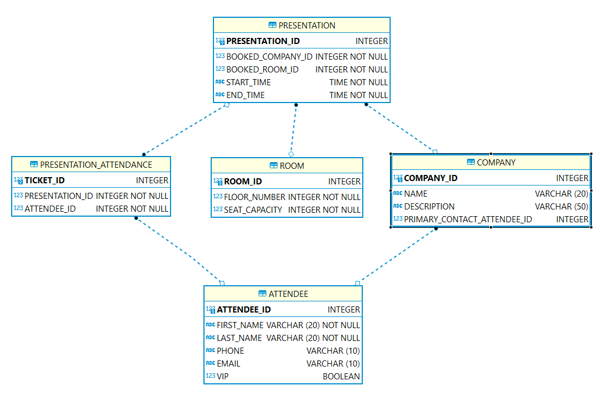
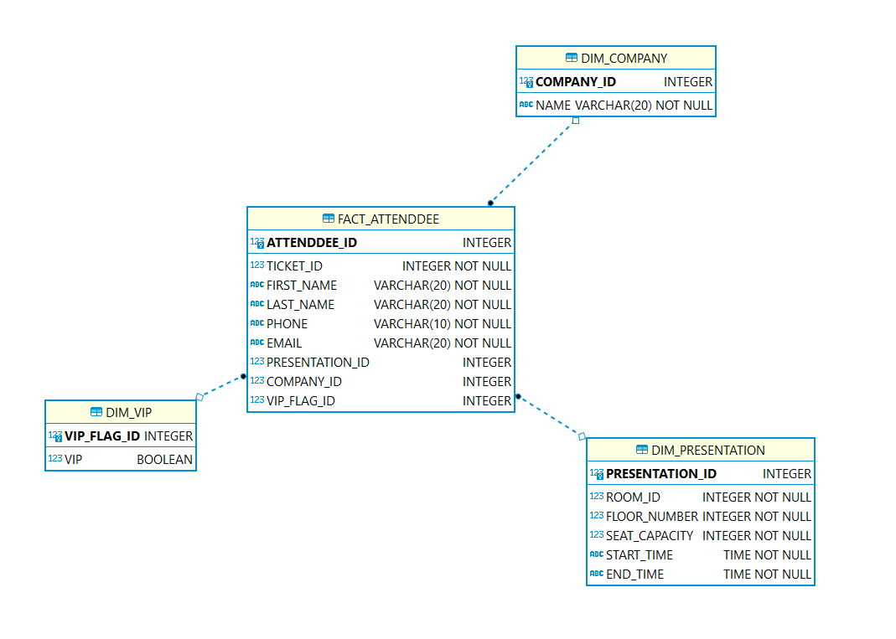

## This Project Problem

    The SurgeTech Conference
        You are a staff member for the SurgeTech conference, a gathering of tech startup
        companies seeking publicity and investors. The organizer has tasked you with creating
        a database to manage the attendees, companies, presentations, rooms, and presentation
        attendance. How should this database be designed?
        First, review the different entities and start thinking about how they will be structured
        into tables. This may seem like a large number of business asks to capture, but any
        complex problem can be broken down into simple components.

## Result

this is my dimensional data modeling design.

## Tool

DBeaver
