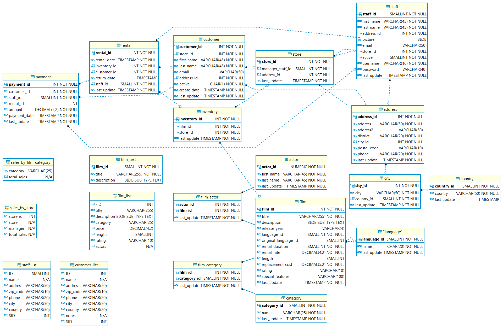
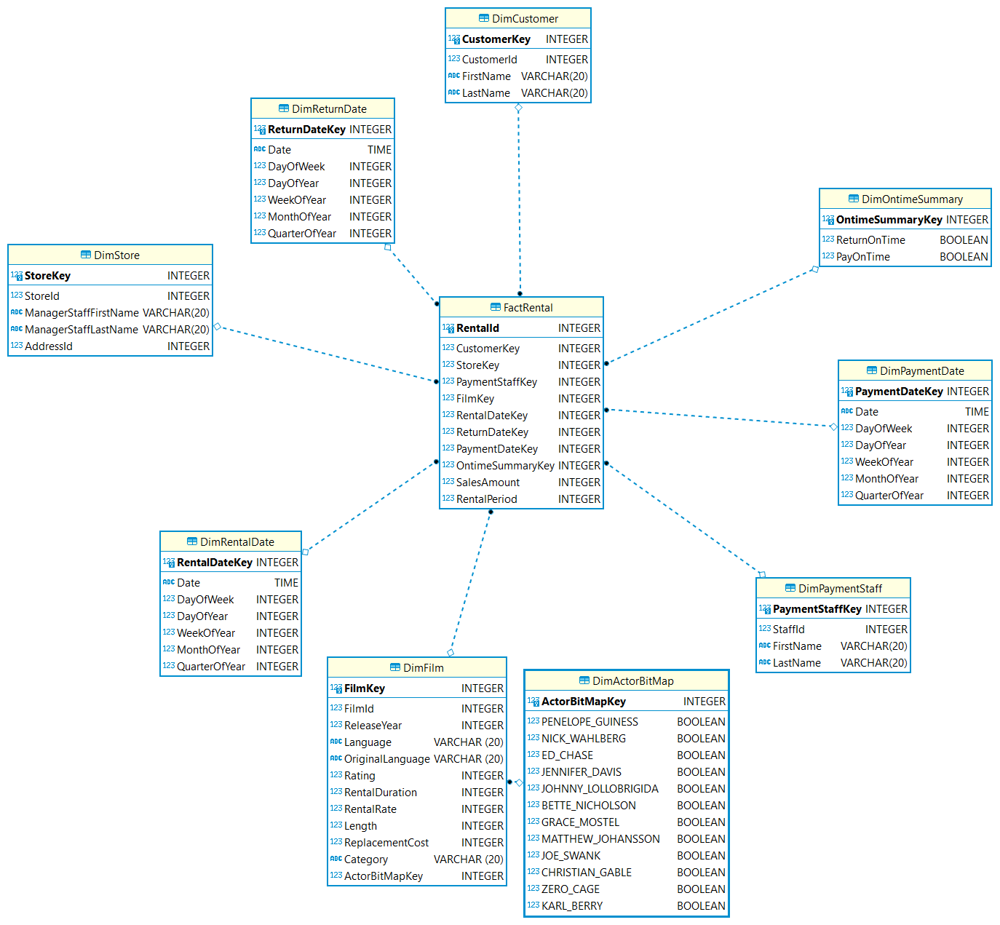

## Background

This sub-project is part of my large project to become a data scientist with independent end-to-end (in the term of data lifecycle) capabilities. 

At the moment (2022-01-30), My study plan is to study from datawarehouse (SQL), ETL (PySpark), Machine Learning Theory (Numpy, Numba, cuPy) and Machine Learning Model Implementation (PyTorch). If you have any suggestion, please feel free to open an issue and share your opinion.

This sub-project is my fist step. Since data warehouse (dimentaional modeling) is convinient for data analytics, I chose to rather focus on it than OLTP. In the term of SQL, I studied from a book named "Getting Started with SQL A Hands-On Approach for Beginners". In the term of data warehouse development, I studied from a book named "The Data Warehouse Toolkit The Complete Guide to Dimensional Modeling". 

## This Sub-project Problem

I got this database from https://www.kaggle.com/atanaskanev/sqlite-sakila-sample-database

 Database Description

    The Sakila sample database is a fictitious database designed to represent a DVD rental store. The tables of the database include film, film_category, actor, customer, rental, payment and inventory among others.
    The Sakila sample database is intended to provide a standard schema that can be used for examples in books, tutorials, articles, samples, and so forth.
    Detailed information about the database can be found on the MySQL website: https://dev.mysql.com/doc/sakila/en/

For me, I think it looks like spyderweb and not easy for new data analyst to know how to start. But I think it is good for maintanance.

For this sub-project, the objective is to create a datawarehouse Sales business process.

## Result

The following is the result of my design

## Retrospective

I think this will be helping me for feature generation. To design OLAP, it trains me to clarify information by asking the following questions:
1. what is the business process being involved?
2. what is the value stream?
3. what really are we interested?
4. what is input and what is output?
5. what are relevent and what are not relevent?

Another thing I realized is that, I was too naived about BI thing. In the begining, I thought we can use BI by just connect it to any database. But actually, things don't work that way. I'm not sure whether connecting OLTP to BI is practical or not but I think it is always better to clarify the cause-effect relationship or its assumption before moving on to use BI. I felt this way before earlier before I just throw data in BI, and tried to analyze someting. I felt like I didn't understand anything just randomly mix-and-matching/pivoting to get what I imagine. That
 was my mistake in the term of efficiency.

 If I have chance to advice someone for starting career in data science, I would recommend them to start from designing OLAP
